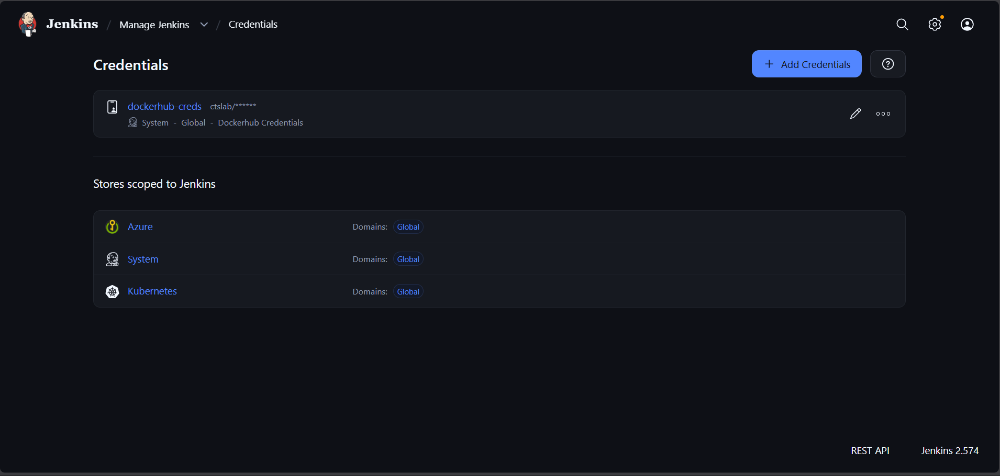
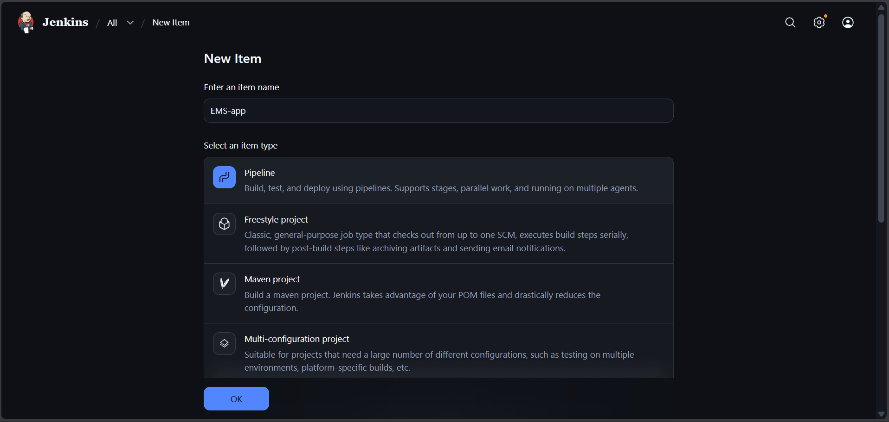
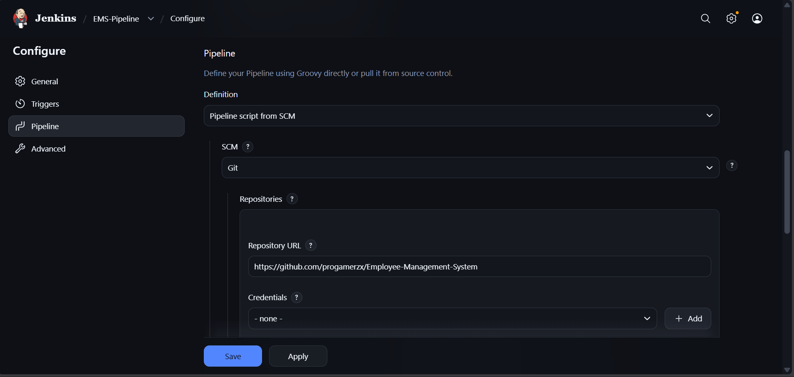
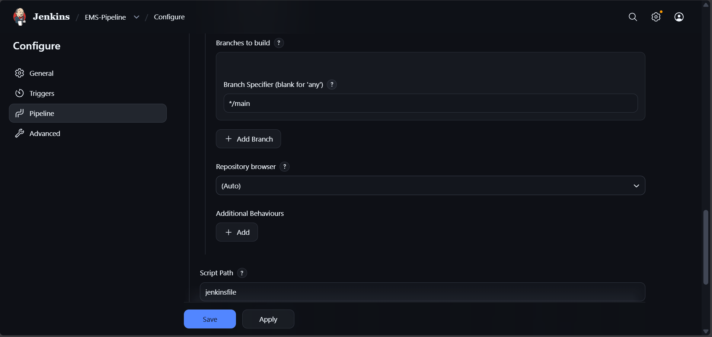
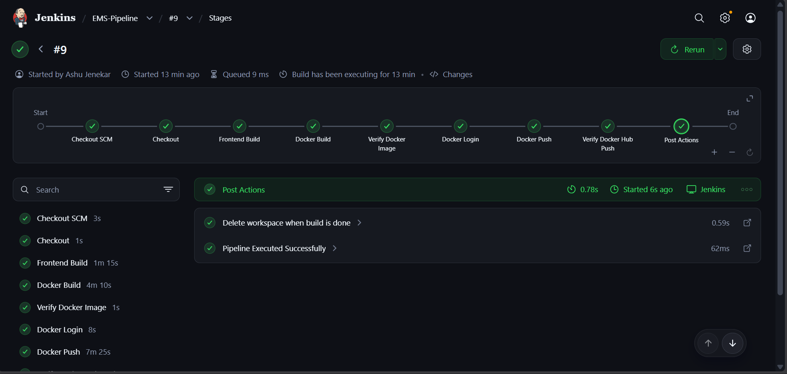
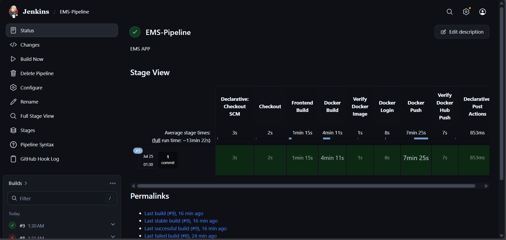
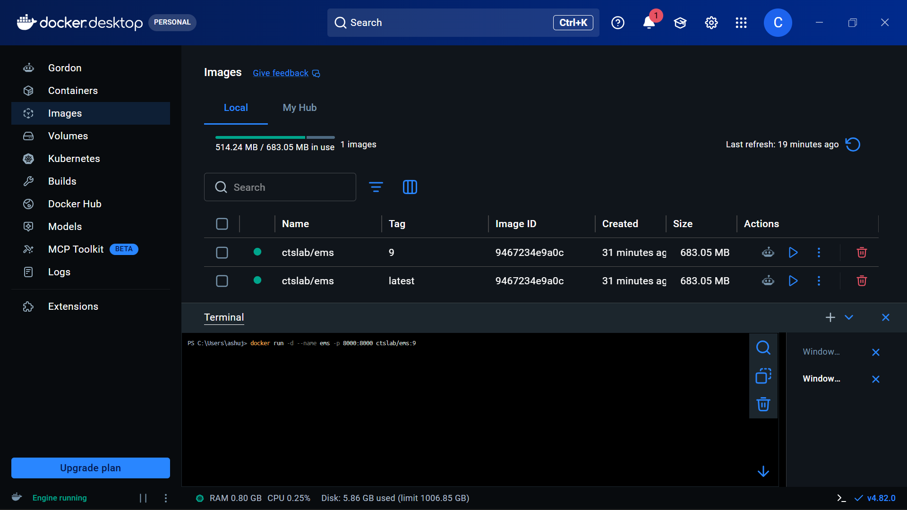
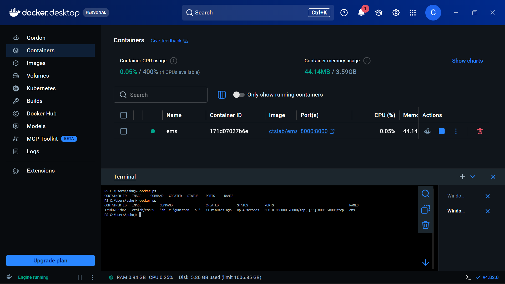

# 🏢 Employee Management System (EMS)

A full-stack Employee Management System built with **React (Vite)** on the frontend and **Python Flask** on the backend, backed by **Azure SQL Database**. The application is containerised with **Docker** and delivered via a **Jenkins CI/CD pipeline** that automatically builds and pushes the image to **Docker Hub**.

---

## 📸 Screenshots

> 


---

## 🧱 Tech Stack

| Layer | Technology |
|---|---|
| Frontend | React 19 + Vite 8, Lucide React |
| Backend | Python 3.11, Flask 3, Flask-CORS, Gunicorn |
| Database | Azure SQL (via pyodbc + ODBC Driver 18) |
| Container | Docker (Multi-Stage Build) |
| CI/CD | Jenkins Pipeline |
| Registry | Docker Hub |

---

## 🗂️ Project Structure

```
EMS/
├── backend/
│   ├── app.py              # Flask REST API
│   ├── requirements.txt    # Python dependencies
│   └── database.sql        # SQL schema reference
├── frontend/
│   ├── src/                # React source code
│   ├── public/
│   ├── index.html
│   ├── vite.config.js
│   └── package.json
├── Dockerfile              # Multi-stage Docker build
├── jenkinsfile             # Jenkins declarative pipeline
└── .env                    # Local environment variables (not committed)
```

---

## ⚙️ Architecture

```
                  ┌─────────────────────────────────┐
                  │         Docker Container         │
                  │                                  │
  Browser ──────► │  Gunicorn (port 8000)            │
                  │     └─► Flask (app.py)           │
                  │           ├─► /api/*  ──────────►│──► Azure SQL DB
                  │           └─► /*  (React SPA)    │
                  └─────────────────────────────────┘
```

The React frontend is compiled at build time (Stage 1 of the Dockerfile) and served as static files by Flask in production — no separate frontend server needed.

---

## 🚀 Running Locally (Without Docker)

### Prerequisites

- Node.js 20+
- Python 3.11+
- ODBC Driver 18 for SQL Server (optional — app falls back to mock data)

### 1. Clone the repository

```bash
git clone https://github.com/<your-username>/Employee-Management-System.git
cd Employee-Management-System
```

### 2. Configure environment variables

Create a `.env` file in the root directory:

```env
DB_SERVER=your-server.database.windows.net
DB_DATABASE=YourDatabase
DB_USERNAME=your_username
DB_PASSWORD=your_password
DB_DRIVER={ODBC Driver 18 for SQL Server}
```

> If no DB credentials are provided, the app runs with an in-memory mock database.

### 3. Install and run the backend

```bash
cd backend
pip install -r requirements.txt
python app.py
```

Backend will start on **http://localhost:8000**

### 4. Install and run the frontend (development mode)

```bash
cd frontend
npm install
npm run dev
```

Frontend dev server starts on **http://localhost:5173**

---

## 🐳 Running with Docker

### Prerequisites

- Docker Desktop installed and running

### Build the image

```bash
docker build -t ctslab/ems:latest .
```

### Run the container

```bash
docker run -d -p 8000:8000 \
  -e DB_SERVER=your-server.database.windows.net \
  -e DB_DATABASE=YourDatabase \
  -e DB_USERNAME=your_username \
  -e DB_PASSWORD=your_password \
  ctslab/ems:latest
```

Open **http://localhost:8000** in your browser.

> **No DB credentials?** Omit the `-e` flags — the app will automatically use the built-in mock dataset.

---

## 🔁 Jenkins CI/CD Pipeline

The `jenkinsfile` defines a declarative Jenkins pipeline that automates the full build and push workflow.

### Pipeline Stages

```
Checkout → Frontend Build → Docker Build → Verify Image → Docker Login → Docker Push → Verify Push
```

| Stage | Description |
|---|---|
| **Checkout** | Clones the repository via SCM |
| **Frontend Build** | Runs `npm ci` and `npm run build` on the Jenkins agent |
| **Docker Build** | Builds the multi-stage Docker image, tagged with `BUILD_NUMBER` and `latest` |
| **Verify Docker Image** | Confirms the image exists locally via `docker image inspect` |
| **Docker Login** | Authenticates to Docker Hub using stored Jenkins credentials |
| **Docker Push** | Pushes both `:<build_number>` and `:latest` tags to Docker Hub |
| **Verify Docker Hub Push** | Pulls the pushed image back to confirm it's accessible |

---

## 🛠️ Jenkins Setup — Step by Step

### Step 1 — Prerequisites on the Jenkins Agent (Windows)

Make sure the following are installed and on the system `PATH`:

- [Node.js 20+](https://nodejs.org/) — for the `Frontend Build` stage
- [Docker Desktop](https://www.docker.com/products/docker-desktop/) — for all Docker stages
- Git

### Step 2 — Add Docker Hub Credentials to Jenkins

1. Go to **Jenkins Dashboard → Manage Jenkins → Credentials**
2. Click **System → Global credentials → Add Credentials**
3. Fill in:
   - **Kind**: Username with password
   - **Username**: your Docker Hub username
   - **Password**: your Docker Hub password or access token
   - **ID**: `dockerhub-creds` ← must match the `credentialsId` in the `jenkinsfile`

> 💡 

### Step 3 — Create a New Pipeline Job

1. From the Jenkins Dashboard, click **New Item**
2. Enter a name (e.g. `EMS-Pipeline`) and select **Pipeline**
3. Click **OK**

> 💡 

### Step 4 — Configure the Pipeline

In the pipeline configuration page:

1. Scroll down to the **Pipeline** section
2. Set **Definition** to: `Pipeline script from SCM`
3. Set **SCM** to: `Git`
4. Enter your **Repository URL**:
   ```
   https://github.com/<your-username>/Employee-Management-System.git
   ```
5. Set **Branch Specifier** to: `*/main`
6. Set **Script Path** to: `jenkinsfile`
7. Click **Save**




### Step 5 — Run the Pipeline

1. Click **Build Now** from the pipeline page
2. Click the build number in **Build History** to watch the console output
3. On success, the image will be available on Docker Hub as `ctslab/ems:<build_number>` and `ctslab/ems:latest`





### Step 6 — Pull and Run the Published Image

Once the pipeline completes, anyone can run the app directly from Docker Hub:

```bash
docker pull ctslab/ems:latest

docker run -d -p 8000:8000 \
  -e DB_SERVER=your-server.database.windows.net \
  -e DB_DATABASE=YourDatabase \
  -e DB_USERNAME=your_username \
  -e DB_PASSWORD=your_password \
  ctslab/ems:latest
```


---

## 🌐 API Reference

| Method | Endpoint | Description |
|---|---|---|
| `GET` | `/api/status` | Check database connection status |
| `POST` | `/api/setup-db` | Initialise the Employees table |
| `GET` | `/api/employees` | List all employees |
| `GET` | `/api/employees/<id>` | Get a single employee |
| `POST` | `/api/employees` | Create a new employee |
| `PUT` | `/api/employees/<id>` | Update an employee |
| `DELETE` | `/api/employees/<id>` | Delete an employee |

---

## 📝 License

This project is for educational and demonstration purposes.
